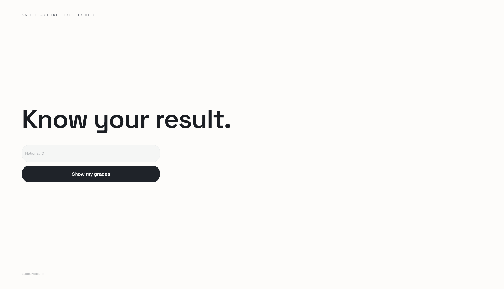

# KFS AI — Results



Check your grades and GPA at the **Faculty of Artificial Intelligence, Kafr
El-Sheikh University** with just your National ID — no captcha, no login. Live
at [ai.kfs.swoo.me](https://ai.kfs.swoo.me).

## How it works

The university's results pages ask for a captcha. We solve it once and reuse
that session for everyone, so students only type their National ID. A
background ping keeps the session alive, and results are cached so each student
is fetched just once.

## Getting started

```bash
bun install
bun dev
```

Open [http://localhost:3000](http://localhost:3000).

## Scripts

- `bun dev` — start the dev server
- `bun build` — production build
- `bun lint` — Biome check
- `bun format` — Biome format

## License

**GNU Affero General Public License v3.0 or later**
([AGPL-3.0-or-later](./LICENSE)). Use it, study it, change it — but if you run
your own version, even as a website, you have to share your source under the
same license. No closed-source forks.
